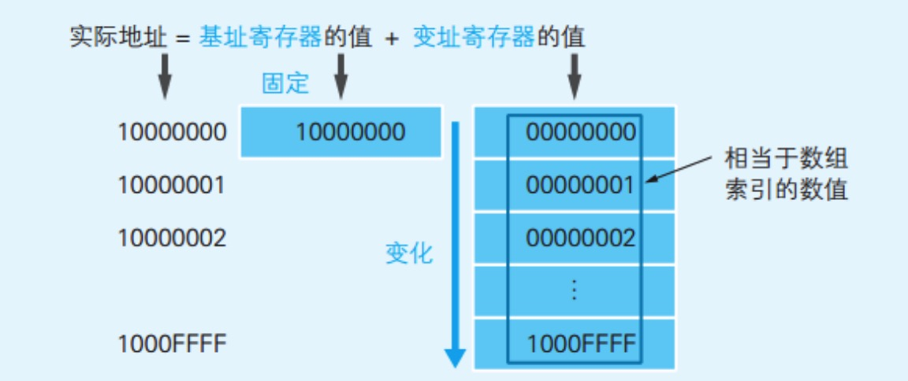
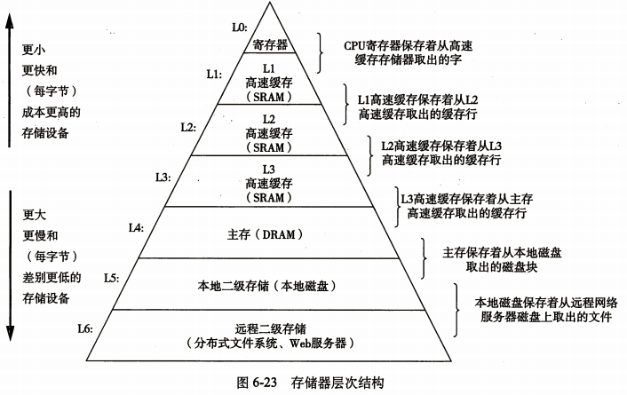

Sunday, April 15, 2018

**小伙伴们写的总结：**

1. [Milo 的总结](https://www.androidwork.club/android/%E6%95%B0%E6%8D%AE%E7%BB%93%E6%9E%84%E4%B8%8E%E7%AE%97%E6%B3%95-%E6%95%B0%E7%BB%84%E4%B8%8E%E9%93%BE%E8%A1%A81_index.html)
2. [知北游的总结](https://github.com/iwannabetop/Awesome-Android-Learning-Guide/blob/master/datastruct/array%26linked/%E6%95%B0%E7%BB%84%E5%92%8C%E9%93%BE%E8%A1%A8_%E7%9F%A5%E5%8C%97%E6%B8%B8.md)
3. [金鑫的数组总结](https://github.com/iwannabetop/Awesome-Android-Learning-Guide/blob/master/datastruct/array%26linked/%E6%95%B0%E7%BB%84_%E9%87%91%E9%91%AB.txt)
4. [金鑫的链表总结](https://github.com/iwannabetop/Awesome-Android-Learning-Guide/blob/master/datastruct/array%26linked/%E9%93%BE%E8%A1%A8_%E9%87%91%E9%91%AB.txt)
5. [Cloud 的总结](https://github.com/iwannabetop/Awesome-Android-Learning-Guide/blob/master/datastruct/array%26linked/%E6%95%B0%E7%BB%84%26%E9%93%BE%E8%A1%A8_Cloud.md)
6. [ZHL 的总结](https://github.com/iwannabetop/Awesome-Android-Learning-Guide/blob/master/datastruct/array%26linked/%E6%95%B0%E7%BB%84%26%E9%93%BE%E8%A1%A8_ZHL.md)
7. [杨哲的总结](https://github.com/iwannabetop/Awesome-Android-Learning-Guide/blob/master/datastruct/array%26linked/%E6%95%B0%E7%BB%84%26%E9%93%BE%E8%A1%A8%E6%80%BB%E7%BB%93_%E6%9D%A8%E5%93%B2.jpeg)
8. [Alex 赵的总结](https://github.com/iwannabetop/Awesome-Android-Learning-Guide/blob/master/datastruct/array%26linked/%E6%95%B0%E7%BB%84_Alex%E8%B5%B5.md)
9. [麦田哥的总结](https://note.youdao.com/share/?id=c93e38805290b0a59e359acfe97f640b&type=note#/)
10. [Anonymous 的总结](https://github.com/iwannabetop/Awesome-Android-Learning-Guide/blob/master/datastruct/array%26linked/%E6%95%B0%E7%BB%84%26%E9%93%BE%E8%A1%A8_Anonymous.md)


题目：从数组链表谈到操作系统

[TOC]

>文章出自：[安卓进阶学习指南](https://github.com/iwannabetop/Awesome-Android-Learning-Guide)

# 背景介绍


大家好，这篇文章是 [《安卓进阶技能树计划》](https://github.com/iwannabetop/Awesome-Android-Learning-Guide) 的第二部分 [《数据结构与算法系列》](https://github.com/iwannabetop/Awesome-Android-Learning-Guide/blob/master/datastruct/README.md) 的第一篇。


# 前言

本来以为数组与链表没什么难点，最多是自己实现的时候注意下边界判断和效率，没想到整理小伙伴总结的过程发现了一些有趣的问题，这里将小伙伴的总结和对一些问题的探讨整理如下。

- 为什么数组比链表遍历快，从操作系统的角度思考，巩固知识
- 内存寻址，段页式存储，内存映射

# 基础概念

数组和链表是数据结构中的基础结构，很多复杂些的数据结构都是基于它俩实现的，比如 Java 中的哈希表就是数组与链表结合组成。

从逻辑结构上而言，数组和链表都是一种线性结构（相对于图、树这种非线性结构而言），而从存储结构上而言，数组是顺序存储的，链表则是链式存储的。

对于顺序存储而言其存储结构是一块连续的内存块，而链式存储则可以不是连续的内存块，并且顺序存储没有链式存储中的指针域（连续内存空间所以加 1 即可找到下一数据）

## 数组的概念、优缺点及使用场景

### 数组的概念

数组是最简单的一种数据结构，它占据一块连续的内存，而且是顺序存储结构。

在创建数组时必须要指定数组的容量大小，在根据数组容量来分配内存。数组可以说是**线性表的顺序存储结构**。

顺序存储示意图：

 

数组**既可以存储基本数据类型，也可以存储引用数据类型**。数组初始化时会为其开辟连续的内存空间，并为数组每个元素赋值。

### 数组优缺点

- 因为数组的内存是连续的，它的存取时间性能为O(1)，因此它的时间效率是很高的
- 缺点在于：需要预先知道数据规模；插入、删除的效率低

### 数组的使用场景

**在下列三个场景使用数组很有优势：**

1. 数据量小或者数据规模已知
2. 对数据存取和修改操作较多，而插入和删除数据较少的情况


## 链表的概念、分类、优缺点及使用场景

### 链表的概念

链表由一些列节点组成，每个节点一般会包含两部分信息：一部分是元素数据本身，另一部分是指向下一个元素地址的指针。

链表即**链式储存结构**，它的内存分配，可以是连续的也可以是不连续的，可以分配在内存未被占用的任意位置。它的内存分配不是在创建链表时一次性完成，而是每添加一次结点分配一次内存，因而没有闲置内存，所以空间效率比数组高。

链式存储示意图：


### 链表的分类

链表分为 3 种类型：单向链表、双向链表和循环链表：

1.单向链表

- 结点只包含一个向下的指针（next），且指向下一个存储单元的结点（node）的链表，叫做单向链表。

2.双向链表

- 结点包含两个指针（prev、next），且prev指向上一个存储单元的结点，next指向下一个存储单元的结点的链表叫做双向链表。
- 注意：
- 由于双向链表的头结点的上一个结点不存在所以双向链表的头结点prev指向null，同理末结点next指向也为null。

3.循环链表

- 结点包含两个指针（prev、next），且prev指向上一个存储单元的结点，next指向下一个存储单元的结点。且头结点的prev指向末结点，末结点的next指向头结点，从而使所有结点形成一个闭环的链表叫做循环链表。


### 链表优缺点

在链式存储结构中除了要存储数据元素信息外，还要存储它的后继元素的存储地址。

- 空间利用率高，不许要预先分配内存空间
- 插入删除效率高，时间复杂度为O(1)
- 缺点在于：存取效率低；时间复杂度为O(n)；对元素操作较复杂，不但需要处理数据，还需要处理指针。

> 链表的添加和删除，都需要考虑当前操作的是否为队首、队尾元素的情况

### 链表的使用场景


**链表使用场景：**

1. 不需要预先知道数据规模
2. 适用于插入删除操作较多，而存取操作较少的情况
3. 可直接使用单向链表实现栈

# 代码实现

说了半天概念，是时候写写代码了！

## 关于面试写代码的建议

啰嗦几句，面试考察手写代码的目的是什么，我的理解是为了这些：

1. 考察你的抽象逻辑能力和经验，遇到问题怎么抽象
2. 考察你的开发习惯，是上来就一把梭，还是先动脑再动手
3. 考察你的编码习惯，有没有考察异常和极端情况
4. 考察你的代码风格，命名如何、代码逻辑够不够简洁

因此，遇到手写数据结构算法笔试题，可以按这些路子来：

https://blog.csdn.net/u011240877

1. 先确认问题，然后尝试举例子
2. 有思路后拿例子顺一遍，验证思路是否正确，不要不举例子就直接写代码，容易走偏！
3. 确认后开始编写，命名要符合用途
4. 先考虑异常情况，判断边界条件
5. 代码风格要简洁， 避免大量 if-else 嵌套，最好先判断异常情况，如果逻辑走到底就及时 return

最后没有思路就厚着脸皮微笑着让对方多提示，不要不好意思硬想！

## 自己实现双向链表

Java 中双向链表使用的比较多，比如缓存队列，我们来自己和实现一下。

**先定义 Node 节点类，包含数据，next 指向的下一个结点和 prev 指向的上一个结点。**如下：


```
    private static class Node<E> {
        E item;
        Node<E> next;
        Node<E> prev;

        Node(Node<E> prev, E element, Node<E> next) {
            this.item = element;
            this.next = next;
            this.prev = prev;
        }
    }
```

**接着定义链表类的成员变量：**

很简单，包含头、尾节点和尺寸信息即可。

```
public class LinkedList<E> {
    public final String TAG = "LinkedList";

    Node<E> head;
    Node<E> tail;
    int size;

    public LinkedList() {
        head = null;
        tail = null;
        size = 0;
    }

    public LinkedList(Collection<E> collection) {
        checkNotNull(collection);

        for (E e : collection) {
            addToTail(e);
        }
    }

    public LinkedList(Node<E> head, Node<E> tail) {
        this.head = head;
        this.tail = tail;
        if (head != null) {
            size++;
        }
        if (tail != null && tail != head) {  //不只有一个元素
            size++;
        }
    }

        //...
}
```

添加和删除操作的逻辑见下图：


可以里看到只要移动前后指针即可，非常方便。

**添加操作（这里只讨论添加到尾部的情况）：**

```
private void addToTail(E data) {
    checkNotNull(data);

    Node<E> newNode = new Node<>(data, null, null);
    if (head == null) {  //之前是空链表
        head = newNode;
        tail = head;
    } else {
        tail.next = newNode;
        newNode.pre = tail;
        tail = newNode;
    }
    size++;
}
```

**删除操作：**

```
    public boolean remove(E o) {
        if (o == null) {
            for (Node<E> x = first; x != null; x = x.next) {
                if (x.item == null) {
                    unlink(x);
                    return true;
                }
            }
        } else {
            for (Node<E> x = first; x != null; x = x.next) {
                if (o.equals(x.item)) {
                    unlink(x);
                    return true;
                }
            }
        }
        return false;
    }
```

可以看出如果删除的对象为空，则从第一个节点开始遍历直到x.item == null的节点，使用unlink(x)删除。

如果x.item != null则从第一个节点开始遍历直到等于要删除的对象为止，最后使用unlink(x)删除，具体如下：

```
    E unlink(Node<E> x) {
        // assert x != null;
        final E element = x.item;
        final Node<E> next = x.next;
        final Node<E> prev = x.prev;

        if (prev == null) {
            first = next;
        } else {
            prev.next = next;
            x.prev = null;
        }

        if (next == null) {
            last = prev;
        } else {
            next.prev = prev;
            x.next = null;
        }

        x.item = null;
        size--;
        modCount++;
        return element;
    }
```

> 查询操作就是从头往后遍历，这里就暂不赘述了。


## 自己实现反转链表

> 本来我自信满满，结果在写的过程中发现我好菜啊，写错了好几次 - 。-。

为什么这道题是面试常客呢，因为链表的反转实质上就是对节点的指针域进行操作，重新建立节点联系的过程，它**同时考察了链表的插入、删除，还有操作顺序**。

> 操作顺序是指操作前后链表节点指针域的状态，在添加和删除同时进行时，需要注意指针数据的保存。

**样例：**

下面是一个链表的开始、反转中和反转结束的状态：

- {1,2,3,4,5} -> {3,2,1,4,5} -> {5,4,3,2,1}


**思路及代码：**

1.我一开始的思路比较笨，想的是维护一个临时引用，然后每次把这个引用的后一个移动到最前面，同时在链表中删除这个节点，代码如下：

```
public void reverse() {
    if (head == null) return;   //没元素还反转毛线
    tail = head;
    Node<E> temp = head;

    while (temp.next != null) {

        //以注释中的数据为例，先把 2 从链表中移除
        Node<E> next = temp.next;
        temp.next = next.next;
        if (next.next != null) {
            next.next.pre = temp;
        }

        //把 2 添加到队首
        addToHead(next);
    }
}

/**
 * 添加到队首
 *
 * @param data
 */
private void addToHead(Node<E> data) {
    checkNotNull(data);

    //设置和队首的指针关系
    head.pre = data;
    data.next = head;
    data.pre = null;

    head = data;
}
```

2.后来看了小伙伴的思路发现 **用两个指针分别指向队首和当前要操作的元素的思路更简单**，这样不需要每次都删除操作节点

```
/**
 * 维护两个指针，每次做的操作就是将 next 插到 temp 前面
 */
public void reverse2() {
    Node temp = head;
    tail = temp;
    Node next = head.next;
    for (int i = 0; i < size - 1; i++) {
        Node nextNext = next.next;//下下个
        next.next = temp;
        temp = next;
        next = nextNext;
    }
    tail.next = null;
    head = temp;
}
```

# 深入一下

上面的内容相信是大多数人都了解，接下来我们再往深挖挖，看点以前不甚了解的。


## 计算机如何实现数组随机访问

在读《轻松学算法》的过程中，里面提到：

> 我们在访问一个数组的某个元素时，必须从第一个元素开始顺序访问，直到访问到指定位置的元素，虽然开发时是直接通过下标去取指定位置的元素，但是计算机实际上是顺序访问的。

读到“计算机实际上是顺序访问的”这句话我感觉打破三观，为了确认自己的理解没问题，查了下相关资料，记录在这里。

我们通常使用数组名和偏移量表示数组中的一个具体元素，比如 a[2] 表示访问数组 a 中的第三个数据。



比如数组 a 的起始位置为 10000000，数组中元素的位置等于起始位置加偏移量，**在 CPU 中起始位置存储在基址寄存器中，而偏移量存储于变址寄存器中**，这样在读取的时候，CPU 会将基址寄存器和变址寄存器存储的值解释为实际查看的内存地址，直接去访问，而不是之前提的“顺序访问”！

## 为什么数组比链表读取数据快

计算机的存储层次结构图如下图所示：




从上图可以看到，各种存储器访问速度差异非常大，尤其第一个 CPU 寄存器速度大概是主存 DRAM 速度的100倍！ 

> 这就是为什么 CPU 产商发明了CPU缓存。 而这个CPU缓存，就是数组和链表的区别的关键所在。

>CPU 缓存会把一片连续的内存空间读入， 因为数组结构是连续的内存地址，所以数组全部或者部分元素被连续存在CPU缓存里面， 平均读取每个元素的时间只要3个CPU时钟周期。   

>而链表的节点是分散在堆空间里面的，这时候CPU缓存帮不上忙，只能是去读取内存，平均读取时间需要100个CPU时钟周期。 这样算下来，数组访问的速度比链表快33倍！ （这里只是介绍概念，具体的数字因CPU而异）

> 这段学习自：https://blog.csdn.net/Islandww/article/details/72511737

## 你不知道的二维数组性能问题

在这次研究数组的过程中，我才发现二位数组访问的角标不一样差别居然这么大！以下面的代码为例：

```
public class ArrayTest {
    /**
     * 测试 Java 中二维数组的存储方式
     * @param args
     */
    public static void main(String[] args) {
        final int ARRAY_SIZE = 10 * 1000;

        int[][] a = new int[ARRAY_SIZE][ARRAY_SIZE];
        int[][] b = new int[ARRAY_SIZE][ARRAY_SIZE];

        long beginTime = System.nanoTime();
        for (int i = 0; i < ARRAY_SIZE; i++) {
            for (int j = 0; j < ARRAY_SIZE; j++) {
                a[i][j] = 0;
            }
        }
        long aCostTime = System.nanoTime() - beginTime;
        System.out.println("a: " + aCostTime);

        long bBeginTime = System.nanoTime();
        for (int i = 0; i < ARRAY_SIZE; i++) {
            for (int j = 0; j < ARRAY_SIZE; j++) {
                a[j][i] = 0;
            }
        }

        long bCostTime = System.nanoTime() - bBeginTime;
        System.out.println("b: " + bCostTime);

        System.out.println("b 和 a 耗时之差: " + (bCostTime - aCostTime));
    }
}
```

看到运行结果你可能会不理解：

```
a: 894277246
b: 5638836219
b 和 a 耗时之差: 4744558973

Process finished with exit code 0
```

为什么第二种比第一种慢这么多呢？

首先可以知道的是，第一种访问是按行的方式访问，先访问第一行的所有数据，然后取访问第二行，以此类推；而第二种是按列的方式访问，先访问每行的第一个元素，然后挨个访问每行的第二个元素，以此类推。

至于为什么按列的方式比按行访问的慢这么多，查阅一些资料后，得到了两种答案：

1. 操作系统每次将数组中同一行的数据加载到寄存器中，按行访问的这些连续的数据都在寄存器中，加载速度快；而按列访问，每次加载到寄存器里只访问一个，然后就得加载另一行的，频繁加载、读取，导致速度比加载一次读取好多要慢；
2. Java 中每次都是从一维数组开始根据内存地址查找，找到一维数组的地址后再找二维数组的地址，然后将此地址的实际值压栈，类似链表结构。第二种 for 循环因为首先要将数组 a 的地址入栈，然后遍历第一维数组，然后用 aaload 将数组当前下标存放的地址值入栈，由于第一维数组不同，所以需要频繁出栈入栈第一维数组，时间就被浪费在这里。

> 第二点摘自：[Java面试题之二维数组性能问题](http://m.xuehuile.com/blog/list_bb2ec69d154948b0b577defcc276843c_1.html)

目前我还不确定哪一种是对的 T.T

## 逻辑地址，段页式内存管理

> 逻辑地址由两部分组成：一个段标识符和一个指定段内相对地址的偏移量（简称偏移量），[段标识符: 段内偏移量]，eg: 2000+4×

> CPU将一个虚拟内存空间中的地址转换为物理地址，需要进行两步：

> 首先将给定一个逻辑地址，CPU要利用其段式内存管理单元，先将每个逻辑地址转换成一个线程地址，再利用其页式内存管理单元，转换为最终物理地址。这就是我们所知道的段页式管理，这样两次转换的好处可以克服段式管理和页式管理的缺点。


# Thanks

- [维基百科：数组](https://zh.wikipedia.org/wiki/%E6%95%B0%E7%BB%84)
- [寻址方式](https://baike.baidu.com/item/%E5%AF%BB%E5%9D%80%E6%96%B9%E5%BC%8F)
- [计算机内存寻址](http://www.cnblogs.com/liuxiaoming/p/3149856.html)
- [从cpu和内存来理解为什么数组比链表查询快](https://blog.csdn.net/Islandww/article/details/72511737)
- [数组真的是随机访问吗](http://haiyangxu.github.io/posts/2014/2014-05-16-array_random_access.html)
- [Java面试题之二维数组性能问题](http://m.xuehuile.com/blog/list_bb2ec69d154948b0b577defcc276843c_1.html)